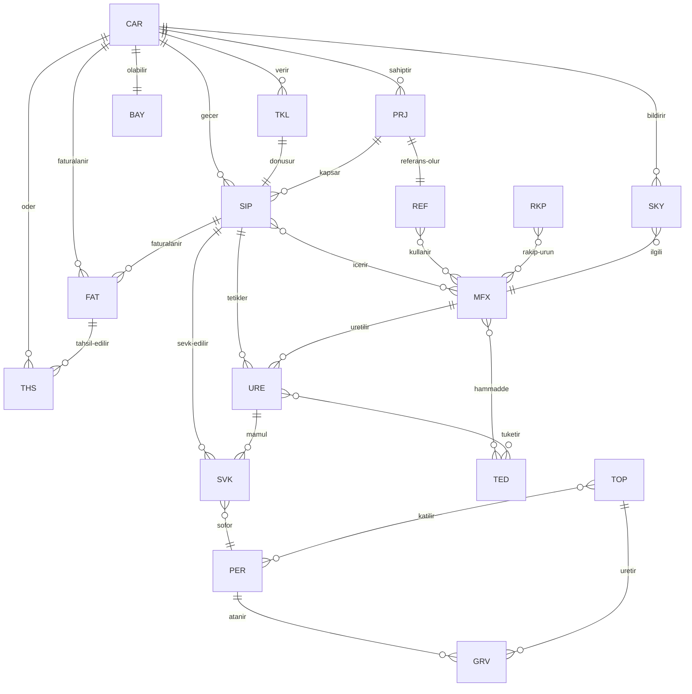

# BÖLÜM 3 — ŞİRKET VERİ MODELİ (17 Varlık + İlişkiler)

> MİRFİX OS'in kalbi bu bölümdür. Yazılım (ERP, CRM, muhasebe) gelir gider; bu 17
> varlık, alanları, kimlik kuralları ve ilişkileri **değişmez**. Her yazılım bu
> modele **eşlenir** (map edilir), model yazılıma teslim olmaz. SSOT budur.

---

## 3.0 Bu Bölümün Sınırı ve Okuma Rehberi

Bölüm 3, MİRFİX'in tüm ticari-operasyonel gerçekliğini **17 varlığa** indirger.
Her varlık için tek bir kanonik tanım (varlık kartı) vardır ve o kart
`vault/99_SISTEM/Veri_Modeli/` altında ayrı bir `.md` dosyası olarak yaşar. Bu
blueprint (MRF-OS-03) o kartların **anayasasıdır**: format, kurallar, ilişki
matrisi ve kalite disiplini burada tanımlanır; kartların kendisi ayrı dosyalardır.

**Kapsam dışı (başka bölümlerde):** iş akışları (B5/n8n), agent davranışları (B4),
dashboard formülleri (B6), klasör-vault düzeni (B2), yetki-onay kapıları (B1).

**17 varlık listesi:** MÜŞTERİ, ÜRÜN, TEKLİF, SİPARİŞ, TAHSİLAT, FATURA/İRSALİYE,
ÜRETİM, SEVKİYAT, TOPLANTI, GÖREV, PERSONEL, PROJE, TEDARİKÇİ, BAYİ, RAKİP,
REFERANS, ŞİKÂYET/İADE. (ŞİKÂYET ve İADE tek kartta iki önekle yönetilir.)

---

## 3.1 Modelleme Standardı — Varlık Kartı Formatı

Her varlık, aşağıdaki **10 zorunlu bölümü** birebir aynı sırayla içerir. Bir kart
bu formata uymuyorsa geçersizdir. Kartların tümü `vault/99_SISTEM/Veri_Modeli/`
altındadır.

### 3.1.1 Kart İskeleti (10 bölüm)

| # | Bölüm | İçerik |
|:---:|---|---|
| 1 | **Amaç** | Varlık neyi temsil eder, hangi ticari gerçeği tutar; 2–3 cümle. |
| 2 | **Kimlik (ID) Kuralı** | Önek, format `<ÖNEK>-<YIL>-<5hane>`, numaranın nereden alındığı, benzersizlik. |
| 3 | **Zorunlu/Opsiyonel Alan Tablosu** | `Alan \| Tip \| Kaynak \| Zorunlu mu \| Doğrulama` sütunlu tam tablo. |
| 4 | **Yaşam Döngüsü Durumları** | Durum listesi + izinli geçişler (state machine). |
| 5 | **İlişkiler** | Hangi varlıklara nasıl bağlanır (1-1 / 1-N / N-N), bağ alanı. |
| 6 | **Sahip (Rol)** | Verinin tekil sorumlusu (kişi değil rol). |
| 7 | **Obsidian Şablonu** | `Templates/` altındaki şablon dosya adı. |
| 8 | **Drive Karşılığı** | Google Drive'daki klasör/dosya eşlemesi. |
| 9 | **İlgili Form (MRF-SAT-*)** | Mevcut form setinden karşılığı. |
| 10 | **Kalite ve Notlar** | Veri kalite kuralları, sık hatalar, uyarılar. |

### 3.1.2 Alan Tablosu Sözlüğü

**Tip değerleri:** `metin`, `metin-uzun`, `sayı`, `tam-sayı`, `para` (₺, 2 hane),
`yüzde`, `tarih` (GG.AA.YYYY), `tarih-saat`, `bayrak` (evet/hayır), `sözlük`
(sabit değer listesi), `bağ` (başka varlığın ID'si — `[[wikilink]]`), `dosya`
(ek/foto/PDF), `hesaplanan` (türetilmiş, elle girilmez).

**Kaynak değerleri:** `elle` (kullanıcı girer), `WhatsApp` (sipariş grubu mesajı),
`fiyat-listesi` (MFX kod sistemi), `risk-matrisi` (8 kademeli A–H), `dış-muhasebe`
(muhasebe bürosu), `sayaç` (ID_Sayaclari.md), `sistem` (otomatik/zaman damgası),
`form` (MRF-SAT-* form karşılığı), `türetme` (başka alandan hesaplanır).

**Zorunlu mu değerleri:** `Z` (zorunlu — boş olamaz), `O` (opsiyonel),
`K` (koşullu — belirli durumda zorunlu; koşul doğrulama sütununda yazılır).

**Doğrulama:** alanın kabul kriteri (aralık, sözlük üyeliği, referans bütünlüğü,
biçim regex vb.). Boş bırakılmaz; en azından "serbest metin, boş olamaz" yazılır.

### 3.1.3 Ortak Alanlar (her kartta bulunur, kartlarda tekrar yazılmaz)

Aşağıdaki alanlar **tüm varlıklarda** vardır ve kartlarda yalnızca varlığa özgü
alanlar listelenir (DRY ilkesi):

| Alan | Tip | Kaynak | Zorunlu mu | Doğrulama |
|---|---|---|:---:|---|
| id | metin | sayaç | Z | `<ÖNEK>-<YIL>-<5hane>` biçimi, benzersiz |
| tip | sözlük | sistem | Z | YAML `tip` alanıyla eşleşir |
| surum | metin | sistem | Z | `vX.Y` |
| tarih | tarih | sistem | Z | oluşturma tarihi |
| sahip | sözlük | sistem | Z | rol kataloğundan |
| durum | sözlük | elle | Z | ilgili yaşam döngüsü değerlerinden |
| olusturan | bağ | sistem | Z | PER-* |
| son_guncelleme | tarih-saat | sistem | Z | otomatik |
| etiketler | metin | elle | O | `#alan/...` biçimi |
| notlar | metin-uzun | elle | O | serbest |

### 3.1.4 Kimlik (ID) Kuralı — Genel

- Format: `<ÖNEK>-<YIL>-<5hane>` → örn. `CAR-2026-00042`.
- Önek varlığa sabittir (bkz. 3.20 tablo).
- 5 hane sıfır dolgulu, `00001`'den başlar.
- Numara **yalnızca** `vault/99_SISTEM/Sayaclar/ID_Sayaclari.md`'den alınır.
- Ürün (MFX) istisnadır: kod fiyat listesinden gelir, sayaç üretmez.

### 3.1.5 Referans Kart (kanonik örnek)

`CAR_Musteri.md` bu formatın referans uygulamasıdır; yeni kart yazan herkes önce
onu inceler. 3.2–3.18 altındaki özetler, kartların **blueprint içi ikizidir**;
kartlarla çelişki olursa **kart değil bu blueprint** esas alınır (blueprint anayasa).

---

## 3.2 MÜŞTERİ (CAR-*)

**Amaç:** MİRFİX'in sattığı her cari hesap — esnaf, bayi, proje müşterisi veya
fason iş verdiğimiz/yaptığımız taraf. Risk, limit, vade ve ticari geçmişin altın
kaydı. Kart: `CAR_Musteri.md`.

**Kimlik:** `CAR-<YIL>-<5hane>`, sayaçtan. Vergi no + unvan benzersizliği ikinci
kontrol.

**Varlığa özgü alanlar:**

| Alan | Tip | Kaynak | Zorunlu mu | Doğrulama |
|---|---|---|:---:|---|
| unvan | metin | elle | Z | boş olamaz, tekil |
| segment | sözlük | elle | Z | esnaf / bayi / proje / fason |
| risk_sinifi | sözlük | risk-matrisi | Z | A,B,C,D,E,F,G,H |
| kredi_limiti | para | risk-matrisi | Z | ≥0; sınıfla tutarlı |
| vade_gun | tam-sayı | risk-matrisi | Z | 0–120; sınıfla tutarlı |
| bolge | sözlük | elle | Z | Pazarcık/Türkoğlu/Adıyaman/Kırıkhan/diğer |
| torba_marka_tercihi | sözlük | elle | O | MİRFİX/İzomir/Dimaxa/Bilfis |
| vergi_no | metin | elle | K | proje/bayi için Z; 10–11 hane |
| iletisim_agaci | metin-uzun | elle | O | kişi-unvan-telefon listesi |
| acik_bakiye | hesaplanan | dış-muhasebe | Z | fatura−tahsilat türevi |
| risk_skoru | hesaplanan | türetme | O | 0–100 |

**Yaşam döngüsü:** `aday → aktif → izlemede → bloke → pasif`.
- aday→aktif: ilk onaylı sipariş.
- aktif→izlemede: gecikme/limit aşımı sinyali.
- izlemede→bloke: tahsilat riski eşiği; **yeni sipariş kapalı**.
- bloke→aktif: borç kapanınca. herhangi→pasif: 12 ay hareketsiz.

**İlişkiler:** 1-N TEKLİF, SİPARİŞ, FATURA, TAHSİLAT, ŞİKÂYET/İADE; N-1 BÖLGE;
opsiyonel bağ PROJE, BAYİ. Fason müşteri N-N ÜRETİM.

**Sahip:** Satış. **Şablon:** `Templates/Musteri_Karti.md`.
**Drive:** `03_MÜŞTERİLER/<CAR-id>_<unvan>/`. **Form:** MRF-SAT-01 (Müşteri Kartı).

---

## 3.3 ÜRÜN (MFX-*)

**Amaç:** Satılan/üretilen her ürün SKU'su — MFX fiyat listesi kod çekirdeğine
birebir bağlı. Reçete, ambalaj, palet ve fiyat katmanlarının altın kaydı. Kart:
`MFX_Urun.md`.

**Kimlik:** `MFX-*` kodu **fiyat listesinden** gelir (sayaç üretmez, B3.20 istisna).

**Varlığa özgü alanlar (özet; tam tablo kartta):**

| Alan | Tip | Kaynak | Zorunlu mu | Doğrulama |
|---|---|---|:---:|---|
| ad | metin | fiyat-listesi | Z | boş olamaz |
| recete_bagi | bağ | elle | K | üretilen ürün için Z |
| ambalaj_varyantlari | sözlük | elle | Z | torba/şirink/streç/zımba/dökme |
| palet_adedi | tam-sayı | elle | Z | >0 (torba/palet) |
| tds_durumu | sözlük | elle | Z | var / yok / güncelleniyor |
| msds_durumu | sözlük | elle | Z | var / yok / güncelleniyor |
| maliyet | para | türetme | Z | ≥0 |
| fiyat_esnaf | para | fiyat-listesi | Z | ≥ maliyet |
| fiyat_bayi | para | fiyat-listesi | Z | ≥ maliyet |
| fiyat_proje | para | fiyat-listesi | Z | ≥ maliyet |
| fason_uretilebilir | bayrak | elle | Z | evet/hayır |

**Yaşam döngüsü:** `taslak → aktif → sınırlı → pasif` (sınırlı = satışa kapalı,
stok eritme). **İlişkiler:** N-N SİPARİŞ/TEKLİF (kalem), 1-N ÜRETİM, N-1 REÇETE,
N-N TEDARİKÇİ (hammadde). **Sahip:** Ar-Ge/Ürün.
**Şablon:** `Templates/Urun_Karti.md`. **Drive:** `05_ÜRÜNLER/<MFX-kod>/`.
**Form:** MRF-SAT-02 (Ürün/Fiyat Kartı).

---

## 3.4 TEKLİF (TKL-*)

**Amaç:** Bir müşteriye verilen fiyatlı öneri; siparişin öncülü, kazan/kaybet
analizinin kaynağı. Kart: `TKL_Teklif.md`.

**Kimlik:** `TKL-<YIL>-<5hane>`, sayaçtan.

**Özgü alanlar:** musteri (bağ CAR, Z), kalemler (bağ MFX + miktar + fiyat, Z),
toplam_tutar (hesaplanan, Z), gecerlilik_tarihi (tarih, Z), fiyat_katmani (sözlük:
esnaf/bayi/proje, Z), kayip_nedeni (sözlük, K — kaybedildi ise Z).

**Kayıp nedeni sözlüğü:** `fiyat-yüksek`, `vade-yetersiz`, `stok-yok`,
`rakip-tercih`, `proje-iptal`, `iletişim-kopuk`, `kalite-şüphesi`, `diğer`.

**Yaşam döngüsü:** `taslak → gönderildi → kazanıldı | kaybedildi | süresi-doldu`.
kazanıldı → SİPARİŞ üretir. **İlişkiler:** N-1 MÜŞTERİ, N-N ÜRÜN, 1-1 SİPARİŞ
(kazanılınca). **Sahip:** Satış. **Şablon:** `Templates/Teklif_Karti.md`.
**Drive:** `04_SATIŞ/Teklifler/`. **Form:** MRF-SAT-03 (Teklif Formu).

---

## 3.5 SİPARİŞ (SIP-*)

**Amaç:** Onaylanmış satış talebi; sevkiyat ve faturanın tetikleyicisi. Kaynağı
çoğunlukla WhatsApp "Mirfix sipariş" grubu mesajıdır. Kart: `SIP_Siparis.md`.

**Kimlik:** `SIP-<YIL>-<5hane>`, sayaçtan.

**Özgü alanlar:** musteri (bağ CAR, Z), kalemler (bağ MFX + miktar + ambalaj, Z),
**whatsapp_kaynak_mesaj** (dosya/metin — orijinal sipariş mesajı bağı, Z),
teslim_bolgesi (sözlük, Z), teslim_tarihi (tarih, Z), **onay_stok** (bayrak, Z),
**onay_risk** (bayrak, Z), **onay_fiyat** (bayrak, Z), toplam_tutar (hesaplanan).

**3 zorunlu onay kuralı:** Sipariş `onaylandı` durumuna geçemez sürece
`onay_stok ∧ onay_risk ∧ onay_fiyat = evet`. AI önerir, insan onaylar (üç onayı
üç rol verebilir: Üretim/Depo–stok, Finans–risk, Satış–fiyat).

**Yaşam döngüsü:** `alındı → onay-bekliyor → onaylandı → üretimde/hazır →
sevk-edildi → kapandı | iptal`. **İlişkiler:** N-1 MÜŞTERİ, N-N ÜRÜN, 1-1 TEKLİF
(varsa), 1-N ÜRETİM, 1-N SEVKİYAT, 1-N FATURA. **Sahip:** Satış.
**Şablon:** `Templates/Siparis_Karti.md`. **Drive:** `04_SATIŞ/Siparisler/`.
**Form:** MRF-SAT-04 (Sipariş Formu).

---

## 3.6 TAHSİLAT (THS-*) + ÖDEME SÖZÜ + ÇEK

**Amaç:** Müşteriden gelen para; ödeme sözü ve çek alt-nesneleriyle tahsilat
riskinin altın kaydı. Kart: `THS_Tahsilat.md`.

**Kimlik:** `THS-<YIL>-<5hane>`, sayaçtan.

**Özgü alanlar:** musteri (bağ CAR, Z), tutar (para, Z), kanal (sözlük:
havale/EFT · kart-taksit · çek · elden/nakit, Z), tarih (tarih, Z), fatura_bagi
(bağ FAT, K), belge_foto (dosya, O).

**ÖDEME SÖZÜ nesnesi:** söz veren (bağ CAR), söz tutarı (para), söz tarihi
(tarih), durum (`açık → tutuldu | ihlal → yeni-söz`). İhlal, risk skorunu ve
CAR durumunu (izlemede/bloke) besler.

**ÇEK ayrı yaşam döngüsü:** `alındı → portföyde → tahsile-verildi →
tahsil-edildi | karşılıksız → hukuki`. Alanlar: çek no, banka, vade, keşideci,
tutar. Karşılıksız çek → CAR bloke + ŞİKÂYET/uyarı zinciri.

**Yaşam döngüsü (tahsilat):** `beklenen → kısmi → tamamlandı | iptal`.
**İlişkiler:** N-1 MÜŞTERİ, N-1 FATURA. **Sahip:** Finans.
**Şablon:** `Templates/Tahsilat_Karti.md`. **Drive:** `06_FİNANS/Tahsilatlar/`.
**Form:** MRF-SAT-05 (Tahsilat/Ödeme Sözü Formu).

---

## 3.7 FATURA ve İRSALİYE (FAT-*)

**Amaç:** Resmi belge katmanı ve **dış muhasebe köprüsü**. MİRFİX içinde kayıt
tutulur, resmi kesim dış muhasebe bürosunda; bu kart ikisini bağlar. Kart:
`FAT_Fatura_Irsaliye.md`.

**Kimlik:** `FAT-<YIL>-<5hane>` (iç referans). e-belge numarası ayrı alan.

**Özgü alanlar:** belge_turu (sözlük: e-fatura/e-arşiv/e-irsaliye, Z), musteri
(bağ CAR, Z), siparis_bagi (bağ SIP, Z), ebelge_no (metin, K), ettn (metin, O),
tutar (para, Z), kdv (para, Z), muhasebe_durumu (sözlük: bekliyor/iletildi/
işlendi/mutabık, Z), irsaliye_no (metin, K — sevkiyatta Z).

**Dış muhasebe köprüsü:** `muhasebe_durumu` alanı senkron durumunu tutar; aylık
241 form mutabakatının fatura ayağı buradan beslenir. Resmi rakam **dış muhasebe**
kaynağıdır; çelişkide muhasebe esas, fark "mutabakat farkı" olarak loglanır.

**Yaşam döngüsü:** `taslak → kesildi → muhasebeye-iletildi → mutabık | iptal-
edildi (iade)`. **İlişkiler:** N-1 MÜŞTERİ, N-1 SİPARİŞ, 1-N TAHSİLAT, 1-1
SEVKİYAT (irsaliye). **Sahip:** Muhasebe (iç: Finans). **Şablon:**
`Templates/Fatura_Karti.md`. **Drive:** `06_FİNANS/Faturalar/`.
**Form:** MRF-SAT-06 (Fatura/İrsaliye Kaydı).

---

## 3.8 ÜRETİM EMRİ (URE-*) + GÜNLÜK ÜRETİM KAYDI

**Amaç:** Ne, hangi makinede, hangi vardiyada, ne kadar üretildi. Bugünkü
"üretim-kasa icmal fotoğrafı" akışının **yapılandırılmış** hali. Kart:
`URE_Uretim.md`.

**Kimlik:** `URE-<YIL>-<5hane>`, sayaçtan.

**Özgü alanlar (üretim emri):** urun (bağ MFX, Z), siparis_bagi (bağ SIP, K),
planlanan_ton (sayı, Z), makine (sözlük, Z), vardiya (sözlük: 1/2/3, Z),
recete_bagi (bağ, Z), fason_mu (bayrak, Z), fason_taraf (bağ CAR/TED, K).

**Günlük üretim kaydı (alt-nesne):** tarih, üretilen_ton (sayı), fire_ton (sayı),
duruş_süresi (sayı, dk), **duruş_nedeni** (sözlük), kasa_icmal_foto (dosya).

**Duruş nedeni sözlüğü:** `çimento-yok`, `kum-yok`, `hammadde-gecikme`, `arıza`,
`elektrik-kesinti`, `bakım`, `personel`, `kalite-durdurma`, `diğer`.

**Yaşam döngüsü:** `planlandı → başladı → duruşta → tamamlandı | iptal`.
**İlişkiler:** N-1 ÜRÜN, N-1 SİPARİŞ, N-N TEDARİKÇİ (hammadde tüketimi),
1-N SEVKİYAT (mamul). **Sahip:** Üretim.
**Şablon:** `Templates/Uretim_Karti.md`. **Drive:** `07_ÜRETİM/Emirler/`.
**Form:** MRF-SAT-07 (Üretim/Vardiya Kaydı).

---

## 3.9 SEVKİYAT (SVK-*) + ARAÇ/ŞOFÖR

**Amaç:** Mamulün müşteriye/şantiyeye taşınması; ~46 plaka filonun ve nakliye
ödemesinin bağ noktası. Kart: `SVK_Sevkiyat.md`.

**Kimlik:** `SVK-<YIL>-<5hane>`, sayaçtan.

**Özgü alanlar:** siparis_bagi (bağ SIP, Z), arac_plaka (bağ ARAÇ, Z), sofor
(bağ ŞOFÖR/PER, Z), yuk_tonaj (sayı, Z), teslim_adresi (metin, Z), irsaliye_bagi
(bağ FAT, K), nakliye_bedeli (para, K), nakliye_odeme_durumu (sözlük, K).

**ARAÇ alt-varlığı:** plaka (metin, tekil), tip (sözlük: kamyon/tır/kamyonet/
forklift), kapasite_ton (sayı), sahiplik (öz/kiralık/fason), muayene_tarihi
(tarih). **ŞOFÖR alt-varlığı:** ad, ehliyet_sınıfı, telefon, PER bağı (öz ise).

**Yaşam döngüsü:** `planlandı → yüklendi → yolda → teslim-edildi | iade-döndü`.
**İlişkiler:** N-1 SİPARİŞ, N-1 ARAÇ, N-1 ŞOFÖR, 1-1 FATURA/irsaliye, opsiyonel
bağ PROJE. **Sahip:** Depo-Sevkiyat. **Şablon:** `Templates/Sevkiyat_Karti.md`.
**Drive:** `08_LOJİSTİK/Sevkiyatlar/`. **Form:** MRF-SAT-08 (Sevkiyat/İrsaliye).

---

## 3.10 TOPLANTI (TOP-*)

**Amaç:** Alınan kararların ve eylem maddelerinin kurumsal hafızaya geçtiği yer.
Kart: `TOP_Toplanti.md`. **Kimlik:** `TOP-<YIL>-<5hane>`, sayaçtan.

**Özgü alanlar:** konu (metin, Z), tarih (tarih-saat, Z), katilimcilar (bağ PER
çoklu, Z), gundem (metin-uzun, Z), kararlar (metin-uzun → KRR üretebilir, Z),
eylem_maddeleri (bağ GRV çoklu, O), ilgili_varlik (bağ herhangi, O).

**Yaşam döngüsü:** `planlandı → yapıldı → takipte → kapandı`.
**İlişkiler:** N-N PERSONEL, 1-N GÖREV, opsiyonel bağ PROJE/MÜŞTERİ/TEDARİKÇİ.
**Sahip:** Toplantıyı düzenleyen rol. **Şablon:** `Templates/Toplanti_Karti.md`.
**Drive:** `01_YÖNETİM/Toplantilar/`. **Form:** MRF-SAT-09 (Toplantı Tutanağı).

---

## 3.11 GÖREV (GRV-*)

**Amaç:** Atanmış, tarihli, sahipli iş maddesi; kararların uygulanma kanıtı. Kart:
`GRV_Gorev.md`. **Kimlik:** `GRV-<YIL>-<5hane>`, sayaçtan.

**Özgü alanlar:** baslik (metin, Z), atanan (bağ PER, Z), atayan (bağ PER, Z),
son_tarih (tarih, Z), oncelik (sözlük: düşük/orta/yüksek/kritik, Z), kaynak
(bağ TOP/herhangi, O), ilerleme (yüzde, O).

**Yaşam döngüsü:** `açık → devam → beklemede → tamamlandı | iptal | gecikti`.
**İlişkiler:** N-1 PERSONEL (atanan/atayan), N-1 TOPLANTI, opsiyonel bağ herhangi.
**Sahip:** Atayan rol. **Şablon:** `Templates/Gorev_Karti.md`.
**Drive:** `01_YÖNETİM/Gorevler/`. **Form:** MRF-SAT-10 (Görev Formu).

---

## 3.12 PERSONEL (PER-*)

**Amaç:** Çalışan altın kaydı; maaş/avans, görev ve sahiplik bağlarının merkezi.
Kart: `PER_Personel.md`. **Kimlik:** `PER-<YIL>-<5hane>`, sayaçtan.

**Özgü alanlar:** ad_soyad (metin, Z), rol (sözlük — rol kataloğu, Z), departman
(sözlük, Z), telefon (metin, Z), ise_giris (tarih, Z), maas (para, K — gizli),
avans_bakiye (hesaplanan, O), sofor_mu (bayrak, O), durum_calisma (sözlük:
aktif/izinli/ayrıldı, Z).

**Maaş/avans bağı:** maaş ve avans hareketleri Finans'a; avans, tahsilat/ödeme
akışında ayrı kalem. Maaş alanı **gizli** (yalnız İK+CEO erişimi, B1 yetki).

**Yaşam döngüsü:** `aday → aktif → izinli → ayrıldı`.
**İlişkiler:** 1-N GÖREV, N-N TOPLANTI, 1-1 ŞOFÖR (sürücü ise), 1-N SEVKİYAT.
**Sahip:** İK. **Şablon:** `Templates/Personel_Karti.md`.
**Drive:** `02_İK/Personel/` (kısıtlı). **Form:** MRF-SAT-11 (Personel Kartı).

---

## 3.13 PROJE (PRJ-*)

**Amaç:** İhale/şantiye bazlı satış fırsatı ve teslim bütünü; birçok sipariş-
sevkiyatı tek çatı altında toplar. Örnek/şablon vaka: **Dulkadiroğlu**. Kart:
`PRJ_Proje.md`. **Kimlik:** `PRJ-<YIL>-<5hane>`, sayaçtan.

**Özgü alanlar:** ad (metin, Z), musteri (bağ CAR, Z), tur (sözlük: ihale/özel-
şantiye/kamu, Z), sehir_bolge (sözlük, Z), tahmini_tonaj (sayı, O), sozlesme_
tutari (para, K), baslangic (tarih, O), bitis_hedef (tarih, O), sorumlu (bağ PER,
Z), asama (sözlük).

**Yaşam döngüsü:** `fırsat → teklif → sözleşme → uygulama → tamamlandı |
kaybedildi | askıda`. **İlişkiler:** N-1 MÜŞTERİ, 1-N TEKLİF/SİPARİŞ/SEVKİYAT,
1-1 REFERANS (bitince). **Sahip:** Satış/CEO. **Şablon:** `Templates/Proje_Karti.md`.
**Drive:** `09_PROJELER/<PRJ-id>_<ad>/`. **Form:** MRF-SAT-12 (Proje Kartı).

---

## 3.14 TEDARİKÇİ (TED-*)

**Amaç:** Hammadde/hizmet sağlayan taraf; **çimento (Limak, Çimsa)**, kum, ambalaj,
fason. Tedarik riskinin altın kaydı. Kart: `TED_Tedarikci.md`.
**Kimlik:** `TED-<YIL>-<5hane>`, sayaçtan.

**Özgü alanlar:** unvan (metin, Z), kategori (sözlük: çimento/kum/kimyasal/
ambalaj/nakliye/fason, Z), **kritiklik** (sözlük: kritik/önemli/normal, Z),
**alternatif_tedarikci** (bağ TED çoklu, K — kritik ise Z), odeme_vadesi (tam-
sayı, O), tedarik_urunleri (bağ MFX/hammadde, O), performans_skoru (hesaplanan,O).

**Kritiklik & alternatif:** çimento gibi kritik girdilerde en az bir alternatif
tedarikçi zorunlu (tek kaynak riski). Duruş nedeni "çimento-yok/kum-yok"
istatistiği bu kartın performans skorunu besler.

**Yaşam döngüsü:** `aday → onaylı → izlemede → pasif`.
**İlişkiler:** N-N ÜRÜN/hammadde, N-N ÜRETİM, 1-N SİPARİŞ (satın alma).
**Sahip:** Satın Alma. **Şablon:** `Templates/Tedarikci_Karti.md`.
**Drive:** `10_SATINALMA/Tedarikciler/`. **Form:** MRF-SAT-13 (Tedarikçi Kartı).

---

## 3.15 BAYİ (BAY-*)

**Amaç:** MİRFİX ürünlerini yeniden satan bölgesel kanal; hedef ve teminat
yönetimi. Kart: `BAY_Bayi.md`. **Kimlik:** `BAY-<YIL>-<5hane>`, sayaçtan.

**Özgü alanlar:** musteri_bagi (bağ CAR, Z — bayi de bir caridir), bolge (sözlük,
Z), aylik_hedef_ton (sayı, O), yillik_hedef_ton (sayı, O), teminat_turu (sözlük:
çek/senet/ipotek/nakit, K), teminat_tutari (para, K), gerceklesme (hesaplanan, O),
temsil_markalar (sözlük: MİRFİX/İzomir/Dimaxa/Bilfis, O).

**Yaşam döngüsü:** `aday → aktif → hedef-altı → askıda → fesih`.
**İlişkiler:** 1-1 MÜŞTERİ, 1-N SİPARİŞ, N-1 BÖLGE, N-N ÜRÜN.
**Sahip:** Satış. **Şablon:** `Templates/Bayi_Karti.md`.
**Drive:** `04_SATIŞ/Bayiler/`. **Form:** MRF-SAT-14 (Bayi Kartı).

---

## 3.16 RAKİP (RKP-*)

**Amaç:** Pazardaki rakip firmalar ve **fiyat gözlem günlüğü**; teklif kaybı
analizinin dış referansı. Kart: `RKP_Rakip.md`. **Kimlik:** `RKP-<YIL>-<5hane>`.

**Özgü alanlar:** unvan (metin, Z), bolge (sözlük, Z), guclu_urunler (metin, O),
**fiyat_gozlem_gunlugu** (metin-uzun/tablo: tarih·ürün·gözlenen-fiyat·kaynak, O),
konumlama (sözlük: ucuz/orta/premium, O), tehdit_seviyesi (sözlük, O).

**Fiyat gözlem günlüğü:** her satır tarihli tek gözlem; teklif `kayip_nedeni =
rakip-tercih` olduğunda buraya çapraz bağ verilir.

**Yaşam döngüsü:** `izleniyor → aktif-tehdit → pasif`.
**İlişkiler:** N-N ÜRÜN (karşı ürün), N-1 BÖLGE, bağ TEKLİF (kayıp).
**Sahip:** Pazarlama/Rakip Analiz. **Şablon:** `Templates/Rakip_Karti.md`.
**Drive:** `11_PAZARLAMA/Rakipler/`. **Form:** MRF-SAT-15 (Rakip İzleme).

---

## 3.17 REFERANS / UYGULAMA (REF-*)

**Amaç:** Tamamlanmış başarılı uygulama/şantiye örneği; satış ve pazarlamanın
kanıt varlığı. Kart: `REF_Referans.md`. **Kimlik:** `REF-<YIL>-<5hane>`.

**Özgü alanlar:** baslik (metin, Z), proje_bagi (bağ PRJ, K), musteri_bagi (bağ
CAR, O), kullanilan_urunler (bağ MFX çoklu, Z), sehir_bolge (sözlük, Z),
uygulama_tarihi (tarih, O), foto_video (dosya çoklu, O), izin_durumu (sözlük:
paylaşılabilir/kısıtlı, Z).

**Yaşam döngüsü:** `taslak → onaylı → yayında | arşiv`.
**İlişkiler:** 1-1 PROJE, N-N ÜRÜN, N-1 MÜŞTERİ. **Sahip:** Pazarlama.
**Şablon:** `Templates/Referans_Karti.md`. **Drive:** `11_PAZARLAMA/Referanslar/`.
**Form:** MRF-SAT-16 (Referans/Uygulama Kartı).

---

## 3.18 ŞİKÂYET (SKY-*) ve İADE (IAD-*)

**Amaç:** Müşteri şikâyeti ve ürün iadesinin altın kaydı; kök neden ve
düzeltici faaliyetin kaynağı. İki önek tek kartta yönetilir. Kart:
`SKY_IAD_Sikayet_Iade.md`. **Kimlik:** `SKY-<YIL>-<5hane>` / `IAD-<YIL>-<5hane>`.

**Özgü alanlar:** kayit_turu (sözlük: şikâyet/iade, Z), musteri (bağ CAR, Z),
urun (bağ MFX, K), siparis_bagi (bağ SIP, O), miktar (sayı, K — iade ise Z),
**kok_neden** (sözlük, Z), aciklama (metin-uzun, Z), duzeltici_faaliyet (bağ GRV,
O), maliyet (para, O), telafi (sözlük: değişim/iade-bedel/iskonto/ret, K).

**Kök neden sözlüğü:** `üretim-kalite`, `reçete-sapma`, `ambalaj-hasar`,
`nakliye-hasar`, `yanlış-ürün`, `eksik-miktar`, `gecikme`, `müşteri-uygulama-
hatası`, `beklenti-uyumsuz`, `diğer`.

**Yaşam döngüsü:** `açıldı → inceleniyor → çözüm-önerildi → çözüldü | reddedildi`.
İade ek durumu: `mal-döndü → stok/imha`. **İlişkiler:** N-1 MÜŞTERİ, N-1 ÜRÜN,
N-1 SİPARİŞ, 1-N GÖREV, bağ FATURA (iade faturası). **Sahip:** Kalite.
**Şablon:** `Templates/Sikayet_Iade_Karti.md`. **Drive:** `12_KALİTE/Sikayet_Iade/`.
**Form:** MRF-SAT-17 (Şikâyet/İade Formu).

---

## 3.19 İlişki Matrisi + ER Diyagramı

### 3.19.1 17×17 Bağlantı Tablosu

Hücre = satır varlığından sütun varlığına ilişki. `1N`=bire-çok, `N1`=çoğa-bir,
`NN`=çoka-çok, `11`=bire-bir, `·`=doğrudan bağ yok. (Kısaltmalar: CAR MFX TKL SIP
THS FAT URE SVK TOP GRV PER PRJ TED BAY RKP REF SKY.)

| ↓dan \ →e | CAR | MFX | TKL | SIP | THS | FAT | URE | SVK | TOP | GRV | PER | PRJ | TED | BAY | RKP | REF | SKY |
|---|:-:|:-:|:-:|:-:|:-:|:-:|:-:|:-:|:-:|:-:|:-:|:-:|:-:|:-:|:-:|:-:|:-:|
| **CAR** | — | · | 1N | 1N | 1N | 1N | · | · | · | · | · | 1N | · | 11 | · | 1N | 1N |
| **MFX** | · | — | NN | NN | · | 1N | 1N | 1N | · | · | · | · | NN | NN | NN | NN | 1N |
| **TKL** | N1 | NN | — | 11 | · | · | · | · | · | · | · | N1 | · | · | N1 | · | · |
| **SIP** | N1 | NN | 11 | — | · | 1N | 1N | 1N | · | · | · | N1 | · | N1 | · | · | 1N |
| **THS** | N1 | · | · | · | — | N1 | · | · | · | · | N1 | · | · | · | · | · | · |
| **FAT** | N1 | N1 | · | N1 | 1N | — | · | 11 | · | · | · | · | N1 | · | · | · | 1N |
| **URE** | · | N1 | · | N1 | · | · | — | 1N | · | · | N1 | · | NN | · | · | · | · |
| **SVK** | · | · | · | N1 | · | 11 | N1 | — | · | · | N1 | N1 | · | · | · | · | · |
| **TOP** | · | · | · | · | · | · | · | · | — | 1N | NN | N1 | N1 | · | · | · | · |
| **GRV** | · | · | · | · | · | · | · | · | N1 | — | N1 | · | · | · | · | · | N1 |
| **PER** | · | · | · | · | 1N | · | 1N | 1N | NN | 1N | — | 1N | · | · | · | · | · |
| **PRJ** | N1 | · | 1N | 1N | · | · | · | 1N | N1 | · | N1 | — | · | · | · | 11 | · |
| **TED** | · | NN | · | · | · | 1N | NN | · | N1 | · | · | · | — | · | · | · | · |
| **BAY** | 11 | NN | · | 1N | · | · | · | · | · | · | · | · | · | — | · | · | · |
| **RKP** | · | NN | N1 | · | · | · | · | · | · | · | · | · | · | · | — | · | · |
| **REF** | N1 | NN | · | · | · | · | · | · | · | · | · | 11 | · | · | · | — | · |
| **SKY** | N1 | N1 | · | N1 | · | N1 | · | · | · | 1N | · | · | · | · | · | · | — |

> Tablo yönlüdür ve karşı hücre simetriktir (CAR→SIP `1N` ise SIP→CAR `N1`).
> ARAÇ ve ŞOFÖR, SEVKİYAT'ın alt varlıklarıdır; matrise ayrı satır açılmaz.

### 3.19.2 ER Diyagramı (mermaid)



### 3.19.3 ASCII Özet Şema (araç-bağımsız yedek)

```
                 ┌─────────┐
                 │  PROJE  │───────────────┐
                 └────┬────┘               │
   ┌─────────┐   ┌────┴────┐   ┌─────────┐ │  ┌─────────┐
   │  RAKİP  │   │ MÜŞTERİ │──▶│ TEKLİF  │ │  │REFERANS │
   └────┬────┘   │  (CAR)  │   └────┬────┘ │  └────┬────┘
        │        └──┬───┬──┘        ▼      │       ▲
        ▼           │   │      ┌─────────┐ │       │
   ┌─────────┐      │   └─────▶│ SİPARİŞ │◀┘       │
   │  ÜRÜN   │◀─────┼─────────▶│  (SIP)  │─────────┘
   │  (MFX)  │      │          └──┬───┬──┘
   └──┬───┬──┘      │             │   │
      │   │         ▼             ▼   ▼
      │   │    ┌────────┐   ┌────────┐ ┌────────┐
      │   └───▶│FATURA  │──▶│ÜRETİM  │ │SEVKİYAT│──▶ARAÇ/ŞOFÖR
      │        │(FAT)   │   │(URE)   │ └────────┘
      ▼        └───┬────┘   └───┬────┘
 ┌─────────┐       ▼            ▼
 │TEDARİKÇİ│  ┌────────┐   ┌────────┐
 │ (TED)   │  │TAHSİLAT│   │ ŞİKÂYET│
 └─────────┘  │(THS)   │   │/İADE   │
              └────────┘   └────────┘

 Yatay omurga: TOPLANTI → GÖREV → PERSONEL tüm varlıklara bağlanabilir.
 Kanal katmanı: BAYİ = MÜŞTERİ'nin özel türü.
```

---

## 3.20 Kimlik Üretim Kuralları ve Çakışma Önleme

### 3.20.1 Önek Tablosu

| Varlık | Önek | Örnek | Sayaçtan mı? |
|---|:---:|---|:---:|
| Müşteri | CAR | CAR-2026-00042 | Evet |
| Ürün | MFX | (fiyat listesi kodu) | **Hayır** |
| Teklif | TKL | TKL-2026-00817 | Evet |
| Sipariş | SIP | SIP-2026-01903 | Evet |
| Tahsilat | THS | THS-2026-00551 | Evet |
| Fatura | FAT | FAT-2026-02210 | Evet |
| Üretim | URE | URE-2026-00388 | Evet |
| Sevkiyat | SVK | SVK-2026-01277 | Evet |
| Toplantı | TOP | TOP-2026-00090 | Evet |
| Görev | GRV | GRV-2026-00456 | Evet |
| Personel | PER | PER-2026-00033 | Evet |
| Proje | PRJ | PRJ-2026-00012 | Evet |
| Tedarikçi | TED | TED-2026-00027 | Evet |
| Bayi | BAY | BAY-2026-00019 | Evet |
| Rakip | RKP | RKP-2026-00008 | Evet |
| Referans | REF | REF-2026-00021 | Evet |
| Şikâyet | SKY | SKY-2026-00014 | Evet |
| İade | IAD | IAD-2026-00006 | Evet |

### 3.20.2 Çakışma Önleme Protokolü (tek sayaç)

1. **Tek kaynak:** Tüm numaralar yalnızca `vault/99_SISTEM/Sayaclar/ID_Sayaclari.md`
   dosyasından alınır. Başka hiçbir yerde numara üretilmez.
2. **Al-ve-artır atomikliği:** Numara ver → aynı işlemde ilgili satırda
   `Son Verilen No` ve `Sonraki` +1 güncellenir. İkisi bir commit'te yapılır.
3. **Git kilidi:** Sayaç dosyası değişiminde çakışma olursa (merge conflict),
   yüksek numara kazanır, düşük numaraya yeni numara verilir; hiçbir ID iki kayda
   verilmez.
4. **Yıl alanı:** ID'de yıl tutulur; yıl değişiminde sayaç **sıfırlanmaz**,
   benzersizlik yıl+5hane ile korunur.
5. **MFX istisnası:** Ürün kodu fiyat listesinden; sayaç satırı bilgilendirme
   amaçlı `—` kalır.
6. **Silme yok:** ID asla yeniden kullanılmaz; iptal edilen kayıt `iptal`
   durumunda kalır, numarası boşa çıkmaz.

---

## 3.21 Veri Kalitesi Kuralları + Veri Sahipliği + Uygulama Kontrol Listesi

### 3.21.1 Veri Kalitesi Kuralları (10 kural)

1. **Zorunlu alan boş olamaz:** `Z` alanı boşsa kayıt "taslak" dışına çıkamaz.
2. **Sözlük dışı değer yasak:** `sözlük` tipli alan yalnız tanımlı değer alır.
3. **Referans bütünlüğü:** `bağ` alanı var olan bir ID'yi göstermeli; kırık
   wikilink haftalık denetimde raporlanır.
4. **Para/oran işareti:** `para ≥ 0`, `yüzde 0–100`; negatif değer gerekçe ister.
5. **Tarih tutarlılığı:** bitiş ≥ başlangıç; teslim ≥ sipariş; vade ≥ fatura.
6. **Tekilllik:** unvan+vergi_no (CAR), plaka (ARAÇ), çek no+banka (ÇEK) tekil.
7. **Risk tutarlılığı:** CAR `risk_sinifi`, `kredi_limiti` ve `vade_gun` ile
   8 kademeli matrise uyumlu olmalı; uyumsuzluk bloke sebebi.
8. **Onay bütünlüğü:** SİPARİŞ 3 onay (stok/risk/fiyat) tamamlanmadan onaylanamaz.
9. **Muhasebe mutabakatı:** FAT `muhasebe_durumu` aylık 241 form mutabakatıyla
   kapanmalı; açık fark loglanır.
10. **Foto kanıtı:** ÜRETİM günlük kaydı ve TAHSİLAT (nakit/çek) kanıt dosyası
    olmadan "tamamlandı" olamaz.

### 3.21.2 Veri Sahipliği Tablosu (RACI özeti — rol bazlı)

| Varlık | Sahip (A) | Girer (R) | Onaylar (A/C) | Okur (I) |
|---|---|---|---|---|
| MÜŞTERİ | Satış | Satış | Finans (risk) | CEO, Muhasebe |
| ÜRÜN | Ar-Ge/Ürün | Ürün | CEO (fiyat) | Satış, Üretim |
| TEKLİF | Satış | Satış | Satış Müd. | Finans |
| SİPARİŞ | Satış | Satış/WhatsApp | Üretim+Finans+Satış | Sevkiyat |
| TAHSİLAT | Finans | Finans | Finans Müd. | CEO, Satış |
| FATURA | Muhasebe | Finans | Dış Muhasebe | CEO |
| ÜRETİM | Üretim | Vardiya Amiri | Üretim Müd. | Satış, CEO |
| SEVKİYAT | Depo-Sevkiyat | Sevkiyat | Depo Müd. | Satış |
| TOPLANTI | Düzenleyen | Katip | Başkan | Katılımcılar |
| GÖREV | Atayan | Atayan | Atayan | Atanan |
| PERSONEL | İK | İK | CEO | Departman Müd. |
| PROJE | Satış/CEO | Proje Sorumlusu | CEO | Üretim, Finans |
| TEDARİKÇİ | Satın Alma | Satın Alma | CEO | Üretim, Finans |
| BAYİ | Satış | Satış | Satış Müd. | Finans |
| RAKİP | Pazarlama | Saha/Satış | Pazarlama Müd. | CEO, Satış |
| REFERANS | Pazarlama | Pazarlama | Pazarlama Müd. | Satış |
| ŞİKÂYET/İADE | Kalite | Kalite/Satış | Kalite Müd. | Üretim, CEO |

### 3.21.3 Uygulama Kontrol Listesi (B3 çıkışı)

- [ ] 17 varlık kartı `vault/99_SISTEM/Veri_Modeli/` altında oluşturuldu.
- [ ] Her kart 3.1'deki 10 bölüm formatına birebir uyuyor.
- [ ] Ortak alanlar (3.1.3) kartlarda tekrar edilmedi, referans verildi.
- [ ] `ID_Sayaclari.md` 18 önek satırını içeriyor (SKY+IAD ayrı satır).
- [ ] Tüm sözlükler (segment, risk, kayıp nedeni, duruş nedeni, kök neden, kanal)
      merkezi ve tek yerde tanımlı.
- [ ] İlişki matrisi (3.19.1) ile kart "İlişkiler" bölümleri çelişmiyor.
- [ ] 24 Obsidian şablonu (B2.6) her kartın "Şablon" satırıyla eşleşiyor.
- [ ] Drive klasör eşlemesi (00–99) her kartta dolu.
- [ ] MRF-SAT-01…17 form karşılıkları her kartta atanmış.
- [ ] Veri kalitesi 10 kuralı için haftalık denetim sorgusu (B2.7) planlandı.
- [ ] Risk matrisi (A–H) CAR alanlarıyla doğrulama bağı kuruldu.
- [ ] WhatsApp sipariş mesajı → SİPARİŞ kaynak alanı akışı (B5) tanımlandı.

### 3.21.4 Sizden Beklenen Girdiler

1. MFX fiyat listesi kod şemasının tam formatı (ürün kodu kaç haneli, alan ayrımı).
2. 8 kademeli risk matrisinin A–H sınıf → limit/vade tam değer tablosu.
3. ~46 araç plaka listesi ve öz/kiralık/fason ayrımı.
4. Dış muhasebe bürosuyla veri alışveriş biçimi (e-belge entegratörü, dosya tipi).
5. MRF-SAT-* form setinin güncel numara-başlık eşlemesinin teyidi.

---

*MRF-OS-03 · v1.0 · 05.07.2026 · Chief Systems Architect Ofisi · SSOT: 17 varlık*
