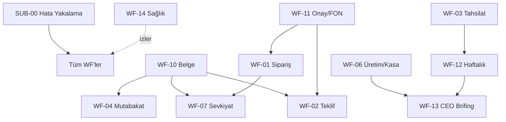

# BÖLÜM 5 — n8n OTOMASYON MİMARİSİ
## 14 İş Akışı — Tetikleyiciden Loga, Uçtan Uca Mühendislik

> **Doktrin:** Otomasyon insanı yormaz, insanın yerine karar VERMEZ. Her iş akışı
> bir insanın tekrar tekrar yaptığı el emeğini alır; kararı — özellikle fiyat, risk,
> tahsilat eskalasyonu — daima insana bırakır. **AI önerir, insan onaylar.**
> Bu bölümdeki hiçbir WF, WhatsApp buton onayı gelmeden fiyatı sabitlemez (FON kuralı).

---

## 5.0 OTOMASYON TASARIM STANDARDI

Her iş akışı bu 12 zorunlu bileşenle kurulur; eksik bileşenli WF canlıya alınmaz.

### 5.0.1 Adlandırma ve Kod Düzeni

| Öğe | Format | Örnek |
|---|---|---|
| Workflow adı (n8n) | `WF-XX_isim` | `WF-01_WhatsApp_Siparis` |
| Belge kodu | `MRF-OS-05 / WF-XX` | referans zinciri |
| Node adı | `[Sıra]_[Fiil]_[Nesne]` | `03_Ayrıştır_Siparis` |
| Credential | `cred_[servis]_[ortam]` | `cred_whatsapp_canli` |
| Webhook path | `/mrf/wf-XX/[olay]` | `/mrf/wf-01/mesaj` |
| Log tablosu | `log_wf_XX` | `log_wf_01` |

Numaralar sabittir; bir WF emekliye ayrılsa bile numarası yeniden kullanılmaz
(agent/ID doktriniyle aynı ilke).

### 5.0.2 Ortak "Hata-Yakalama" Alt Akışı (`SUB-00_Hata_Yakalama`)

Her WF'in **Error Trigger**'ı bu tek merkezi alt akışa bağlanır. Kod tekrarını
önler, hata davranışını standartlaştırır.

```
Error Trigger (herhangi bir WF)
   → 1_Zenginlestir  : {wf_kod, node, hata_mesaji, girdi_ozeti, calisma_id, zaman}
   → 2_Siniflandir   : geçici mi (timeout/429/5xx) | kalıcı mı (400/kimlik/şema)
   → 3_Karar
        ├─ GEÇİCİ  → Retry kuyruğuna yaz (bkz. 5.0.3)
        └─ KALICI  → Retry YOK, doğrudan insana
   → 4_Bildir        : WhatsApp "Sistem-Alarm" grubu + AI-KOS/00_INBOX not
   → 5_Logla         : log_hata (append-only)
```

### 5.0.3 Retry Politikası — 3 Deneme + İnsan Bildirimi

- **Yalnızca geçici hatalar** yeniden denenir (429, 5xx, ağ timeout, WhatsApp API rate-limit).
- **Üstel geri çekilme:** 1. deneme +30 sn, 2. deneme +2 dk, 3. deneme +10 dk.
- 3 deneme de başarısızsa: WF durur, `durum=beklemede_insan` işaretlenir, **sorumlu role**
  WhatsApp + AI-KOS bildirimi düşer. Sistem sessizce vazgeçmez; her ölü iş görünür kalır.
- İdempotentlik: her WF girişte `calisma_id` (mesaj id / dosya hash / form id) üretir;
  aynı `calisma_id` daha önce işlendiyse tekrar işlenmez (çift sipariş/çift SMS koruması).

### 5.0.4 Kill-Switch (Acil Durdurma)

- AI-KOS'ta `99_SISTEM/n8n/_KILL_SWITCH.md` dosyasında `otomasyon: aktif|durduruldu`
  bayrağı tutulur.
- Her WF'in 1. node'u bu bayrağı okur (`Set` + `IF`). `durduruldu` ise WF hiçbir dış
  aksiyon (mesaj, fatura, ödeme hatırlatma) yapmadan sonlanır, sadece "kill-switch açık"
  logu bırakır.
- **Kademeli kill-switch:** Kritik (para/dış mesaj gönderen) WF'ler `KS_DIS_MESAJ`;
  tüm sistem `KS_GLOBAL`. CEO tek satırla dış dünyaya çıkan tüm otomasyonu susturabilir.

### 5.0.5 Log Şeması (Ortak)

Her WF her çalışmada tek bir append-only log satırı yazar (AI-KOS `.md` günlüğü +
opsiyonel SQLite/Sheet ayna):

```yaml
calisma_id: wf01-2026-07-05-00123
wf_kod: WF-01
tetikleyici: whatsapp_grup_mesaji
girdi_ozeti: "Ahmet İnşaat 40 torba MİRFİX 300"
karar_noktalari: {stok: yeterli, risk: dusuk, fiyat_onay: bekliyor}
ai_dugumu: {model: claude, token_giris: 820, token_cikis: 210, guven: 0.86}
insan_mudahale: {gerekli: true, rol: Satış, durum: onaylandi, sure_sn: 340}
sonuc: SIP-2026-00818 taslak
hata: null
sure_toplam_sn: 356
zaman: 2026-07-05T09:41:22+03:00
```

### 5.0.6 Test / Canlı Ortam Ayrımı

- İki ayrı n8n ortamı: **`test`** (sandbox WhatsApp numarası, kukla cari, dry-run
  flag'i `SIMULE=true`) ve **`canli`**.
- Credential'lar ortam bazlı: `cred_..._test` / `cred_..._canli`. Test credential'ı
  canlı veriye erişemez.
- `SIMULE=true` iken WF tüm adımları çalıştırır ama **dış aksiyonları loglar, yapmaz**
  (mesaj göndermez, fatura kesmez). Kabul kriteri: her WF önce `test`'te 10 örnek
  senaryodan geçmeden `canli`ye alınmaz.
- Terfi süreci: `test` WF JSON export → code review (AI-KOS PR) → `canli` import → smoke test.

### 5.0.7 Ortak İnsan Müdahale Deseni

İnsan müdahalesi tek desenle: **WhatsApp interaktif buton** (Onayla / Reddet / Düzelt)
+ zaman aşımı (varsayılan 4 saat, tahsilatta 24 saat). Yanıt gelmezse WF `askıda`
kalır, ilgili role hatırlatma gider, karar asla otomatik "evet"e dönmez.

---

## 5.1 ORTAM KARARI

### 5.1.1 Self-Host vs Cloud

| Kriter | Self-host (öneri) | n8n Cloud |
|---|---|---|
| Veri egemenliği (cari, fiyat, kasa) | ✅ tam kontrol, KVKK | dış sunucu |
| Maliyet (46 plaka, ~500 çalışma/gün) | sabit VPS ~aylık | icra sayısına bağlı artar |
| WhatsApp/OCR entegrasyonu | serbest | kısıtsız ama pahalı |
| Bakım yükü | bizde (yedek, güncelleme) | n8n'de |

**Karar:** Faz-1'de **self-host** (Kahramanmaraş ofis + bulut VPS yedek), Docker
Compose ile `n8n + postgres + redis (queue mode)`. Tek noktadan çökmeyi önlemek için
queue mode: `main` + en az 1 `worker`. Cloud yalnızca felaket kurtarma sıcak yedeği.

### 5.1.2 Credential Kasası

- Tüm sırlar n8n şifreli credential store'da; `.env`'de yalnızca `N8N_ENCRYPTION_KEY`.
- `N8N_ENCRYPTION_KEY` AI-KOS dışında, offline password manager + kasa yedeği.
- Erişim: credential'ları yalnızca "Sistem Yöneticisi" rolü görür; WF tasarımcıları
  credential adını kullanır, değerini görmez.
- Rotasyon: WhatsApp/Claude API anahtarları 90 günde bir; rotasyon takvimi WF-14'te.

### 5.1.3 Git'e Workflow Yedeği

- Her WF JSON'u `99_SISTEM/n8n/exports/WF-XX.json` altında Git'te versiyonlanır.
- **Otomatik export:** WF-14 gecelik olarak tüm workflow'ları n8n API'den çeker,
  değişiklik varsa AI-KOS Git repo'suna commit'ler (`n8n-yedek: 2026-07-05`).
- Böylece "kim neyi değiştirdi" Git history'de; geri alma tek `git revert`.
- Credential'lar **Git'e girmez** (sadece isim referansı); sır sızıntısı riski yok.

---

## 5.2 WF-01 — WhatsApp Sipariş Yakalama

**Amaç:** "Mirfix sipariş" WhatsApp grubuna düşen serbest metin/ses siparişleri
yakala, AI ile yapılandır, SIP taslağı üret, stok+risk+fiyat onayına ver, numara ver.

**Tetikleyici:** WhatsApp Business API webhook — yalnızca "Mirfix sipariş" grubu (`group_id` filtresi).

**Adım şeması (özet):**
```
1  Kill-switch + idempotent (message_id) kontrol
2  Medya tipi ayrımı: metin | ses | görsel
      ses → Whisper/STT transkript
3  AI Ayrıştır (Claude): müşteri, ürün, miktar (palet/torba), marka
      (MİRFİX/İzomir/Dimaxa/Bilfis), ambalaj (şirink/streç/zımba), bölge, teslim
4  Cari eşleştir (fuzzy) → yoksa "aday cari" işareti
5  Stok kontrol (URE/stok kaydı) → yeterli? kısmi? yok?
6  Risk matrisi (8 kademe) çağır → cari risk skoru
7  Fiyat: MFX-* listesinden çek → FON onayı gerekiyor mu?
8  SIP TASLAK üret (numara HENÜZ verilmez)
9  WhatsApp buton onayı: [Onayla] [Düzelt] [İptal] → satışçıya
10 Onay → ID_Sayaclari'ndan SIP no al → SIP kesinleş → WF-11/WF-07 tetikle
```
Detay dosyası: [[WF-01_WhatsApp_Siparis]]. Bağlı agent: **Sipariş Ayrıştırma
Agent (A-SAT-02)**, Risk Agent, Fiyat Agent.

**Kritik karar noktası:** Serbest metin siparişte AI güven skoru < 0.80 ise SIP taslağı
"düşük güven" bayrağıyla insana zorunlu düşer — otomatik ilerlemez.

---

## 5.3 WF-02 — Teklif Üretim, Gönderim ve Takip

**Amaç:** TKL şablonundan (MRF-SAT-TKL) tek tuşla PDF teklif üret, müşteriye gönder,
7. gün yanıt yoksa hatırlat.

**Tetikleyici:** ① MZF ziyaret formunda "teklif iste" ② manuel form ③ WF-05 görev.

**Adım şeması (özet):**
```
1  Girdi doğrula (cari, ürün-fiyat kalemleri, geçerlilik)
2  Fiyat FON kontrolü → indirim eşiği aşıldıysa WF-11 onay
3  TKL no al → şablon+veri → PDF (WF-10 çağrısı)
4  Gönder (WhatsApp/e-posta) + "gönderildi" logla
5  7 gün bekleme zamanlayıcısı kur
6  7. gün: yanıt var mı? (SIP'e döndü / red / sessiz)
      sessiz → hatırlatma mesajı + satışçıya görev
7  14. gün hâlâ sessiz → "soğuk teklif" işaretle, CRM'e not
```
Detay: [[WF-02_Teklif]]. **KPI:** teklif→sipariş dönüşüm %, ort. yanıt süresi.

---

## 5.4 WF-03 — Tahsilat Hatırlatma

**Amaç:** Vade kademelerinde (−7 / 0 / +7 / +14 / +30 gün) otomatik, nazik→resmî
tonlama artan hatırlatma; +30'da THS eskalasyonu (risk yükselt + CEO görünürlüğü).

**Tetikleyici:** Gecelik cron (03:00) → vadesi yaklaşan/geçen FAT taraması.

**Kademe tonlaması:**
| Kademe | Ton | Aksiyon | İnsan |
|---|---|---|---|
| −7 gün | bilgilendirme | "vade yaklaşıyor" mesajı | otomatik |
| 0 gün | nazik hatırlatma | vade günü mesajı | otomatik |
| +7 gün | takip | mesaj + satışçı bilgi | otomatik |
| +14 gün | resmî | mesaj + finansa görev | **onay** |
| +30 gün | eskalasyon | risk +1 kademe, CEO panosu, THS aç | **zorunlu insan** |

Detay: [[WF-03_Tahsilat_Hatirlatma]]. **Kritik:** +14 ve +30 mesajları **insan onayı**
olmadan gitmez — müşteri ilişkisi otomatik bozulmaz.

---

## 5.5 WF-04 — Mutabakat Gönderimi

**Amaç:** 241 formluk aylık mutabakat sürecini otomatikleştir — bakiye çek, form
üret, gönder, yanıt (mutabık/itiraz) takip et, itirazları finansa yönlendir.

**Tetikleyici:** Aylık cron (ayın 1'i, 09:00) + manuel tekil tetik.

**Adım şeması (özet):**
```
1  241 cari listesini + ay sonu bakiyeleri çek
2  Her cari için mutabakat formu üret (WF-10 şablon) → PDF
3  Toplu gönderim (throttle: WhatsApp rate-limit'e uyum, kademeli)
4  "gönderildi/241" ilerleme sayacı
5  Yanıt bekleme: [Mutabıkım] [İtiraz] butonları
6  Mutabık → kapat, logla | İtiraz → finansa görev + fark analizi
7  7 gün yanıtsız → 2. hatırlatma | 14 gün → satışçı devreye
8  Ay sonu icmal: mutabık X / itiraz Y / sessiz Z → CEO raporu
```
Detay: [[WF-04_Mutabakat]]. **KPI:** mutabakat kapanış oranı, ort. kapanış süresi.

---

## 5.6 WF-05 — CRM Güncelleme

**Amaç:** MZF ziyaret formu geldiğinde müşteri dosyasını güncelle, otomatik görev üret
(teklif iste, numune gönder, geri dön), bir sonraki ziyaret planla.

**Tetikleyici:** MZF ziyaret formu gönderimi (Obsidian not / form webhook).

**Adım şeması (özet):**
```
1  Formu ayrıştır (ziyaret notu, ilgi, talep, rakip bilgisi)
2  Cari dosyasına ziyaret kaydı append + son_temas güncelle
3  AI: aksiyon çıkar (teklif? numune? şikâyet? risk sinyali?)
4  GRV görevleri üret, sorumlu+termin ata
5  Rakip bilgisi varsa RKP dosyasına kırp
6  Sonraki ziyaret önerisi (ziyaret sıklığı kuralına göre)
7  Uzun süredir ziyaret edilmeyen cari → "ihmal" uyarısı
```
Detay: [[WF-05_CRM_Guncelleme]]. Bağlı agent: **CRM Agent**.

---

## 5.7 WF-06 — Günlük Üretim & Kasa İcmal

**Amaç:** Vardiya sonu gönderilen **üretim ve kasa icmal FOTOĞRAFLARINI** OCR/AI ile
yapılandırılmış kayda çevir; dünle/geçmiş ortalamayla kıyasla; tutarsızlıkta alarm
("dün üretim iyiydi, bugün niye düşmüş?").

**Tetikleyici:** WhatsApp "üretim-kasa" akışına düşen fotoğraf + gecelik icmal cron.

**Adım şeması (özet):**
```
1  Fotoğraf al → kalite kontrol (okunur mu? tekrar iste)
2  OCR/Vision AI → tablo yapısı: ürün, üretilen ton/torba, vardiya, kasa giriş/çıkış
3  Doğrulama: toplamlar tutuyor mu? negatif/absürt değer?
4  Dünkü + 7 günlük ortalama + aynı gün geçen hafta ile kıyas
5  Sapma > eşik (örn. üretim −%25) → "tutarsızlık alarmı" + neden sorusu
6  Yapılandırılmış kaydı URE/kasa defterine yaz
7  Günlük icmal notu üret → WF-13 CEO brifingine besle
```
Detay: [[WF-06_Uretim_Kasa_Icmal]]. **İnsan:** AI okuması "düşük güven" ise fotoğrafı
insana doğrulatır; asla tahmini kesin kayıt yapmaz.

---

## 5.8 WF-07 — Sevkiyat Bildirimi

**Amaç:** "Araç çıktı" mesajıyla sevkiyatı başlat, müşteriye bildir, SVK kaydını
teslimatta kapat, **palet iade sayacını** işle.

**Tetikleyici:** "araç çıktı" WhatsApp mesajı / SIP onayından sonra sevk emri.

**Adım şeması (özet):**
```
1  SIP↔araç(plaka)↔SVK eşle
2  Müşteriye "yolda, tahmini varış" bildirimi
3  Palet/ambalaj çıkışını palet iade defterine borç yaz
4  Teslimatta [Teslim edildi] onayı → SVK kapat
5  İade palet sayısını gir → palet iade sayacını güncelle (borç düş)
6  Eksik iade → cari palet borcu uyarısı
7  Teslim POD (fotoğraf/imza) arşivle
```
Detay: [[WF-07_Sevkiyat]]. 46 plaka filo + fason araç ayrımı; bölge (Pazarcık/
Türkoğlu/Adıyaman/Kırıkhan) rotasına göre gruplama.

---

## 5.9 WF-08 — Toplantı İşleme

**Amaç:** Toplantı ses kaydı/metnini al → özet + kararlar + görevler + varlık
ilişkilendirme (cari, proje, kişi) → TOP kaydı ve GRV görevleri üret.

**Tetikleyici:** Ses/metin dosyası yükleme (AI-KOS 00_INBOX / WhatsApp).

**Adım şeması (özet):**
```
1  Ses → transkript (STT) | metin doğrudan
2  AI: özet + karar listesi + görev listesi (sorumlu, termin) + katılımcı
3  Varlık ilişkilendir: geçen cari/proje/ürün/kişi adlarını linkle
4  TOP no al → toplantı notu üret (şablon)
5  Kararları Karar Defteri'ne (KRR) yaz
6  Görevleri GRV olarak aç, sorumlulara bildir
7  İlgili cari/proje dosyalarına 3-bağlantı kuralıyla bağla
```
Detay: [[WF-08_Toplanti]]. Kurumsal Hafıza motoruna (B7) besler.

---

## 5.10 WF-09 — İçerik Fabrikası

**Amaç:** Tek "içerik atomu"ndan (ürün başarısı, uygulama videosu, teknik ipucu)
6 kanala uyarlanmış çıktı matrisi üret; insan onayından sonra yayınla.

**Tetikleyici:** Manuel içerik atomu girişi / pazarlama takvimi cron.

**6 kanal matrisi:**
| # | Kanal | Format | Ton |
|---|---|---|---|
| 1 | Instagram | görsel + kısa metin + hashtag | görsel/enerjik |
| 2 | WhatsApp bayi | duyuru mesajı | net/aksiyon |
| 3 | LinkedIn | kurumsal metin | profesyonel |
| 4 | Web/blog | uzun SEO metni | bilgilendirici |
| 5 | YouTube/Shorts | senaryo + başlık | anlatı |
| 6 | Katalog/PDF | teknik bülten | resmî |

Detay: [[WF-09_Icerik_Fabrikasi]]. **İnsan:** hiçbir içerik onaysız yayınlanmaz;
tüm çıktı "taslak" olarak pazarlama onayına düşer.

---

## 5.11 WF-10 — Belge Üretimi

**Amaç:** Şablon + veri → docx/PDF; MRF-SAT-* ve mutabakat formlarını otomatik doldur.
Diğer WF'lerin ortak "belge üret" servisidir.

**Tetikleyici:** Diğer WF'lerden çağrı (WF-02, WF-04, WF-07) / manuel.

**Adım şeması (özet):**
```
1  Şablon seç (TKL/SIP/MZF/Mutabakat/İrsaliye)
2  Veri bağla (cari, kalemler, tarih, no)
3  Render → docx → PDF
4  Kod/no bas, filigran (taslak/resmî), imza alanı
5  Arşivle (ilgili vault klasörü) + link döndür
6  Şablon-veri uyumsuzluğu → hata, üretme
```
Detay: [[WF-10_Belge_Uretimi]]. Merkezî servis: tek yerde şablon bakımı.

---

## 5.12 WF-11 — Onay Akışı (FON)

**Amaç:** Fiyat onayı gereken her durumda (indirim eşiği, özel fiyat, riskli cari)
**WhatsApp buton onayına** bağlı FON akışı. Onaysız fiyat sabitlenmez.

**Tetikleyici:** WF-01/WF-02'den "fiyat onayı gerekli" sinyali.

**Adım şeması (özet):**
```
1  Onay bağlamını topla (cari, ürün, istenen fiyat, liste fiyatı, indirim %, risk)
2  AI öneri: onay/ret gerekçesi + emsal (benzer geçmiş onaylar)
3  Yetki kademesi belirle (indirim %'sine göre: satışçı / müdür / CEO)
4  WhatsApp buton: [Onayla] [Reddet] [Şartlı] → doğru yetkiliye
5  Yanıt bekle (zaman aşımı 4 saat → hatırlat, otomatik onay YOK)
6  Onay → fiyatı sabitle, kaynağı WF'e döndür, FON logla
7  Ret → gerekçe iste, kaynağı bilgilendir
```
Detay: [[WF-11_Onay_Akisi]]. **Bu WF felsefenin kalbi:** AI önerir, insan onaylar,
onay WhatsApp butonundan gelir, her onay iz bırakır.

---

## 5.13 WF-12 — Haftalık Yönetim Raporu

**Amaç:** Haftalık satış/tahsilat/üretim/CRM/mutabakat verisini derle, KPI'ları
hesapla, sapma yorumu ekle, yönetim raporu üret.

**Tetikleyici:** Haftalık cron (Pazartesi 07:00).

**İçerik:** satış (marka/bölge kırılım), teklif dönüşüm, tahsilat performansı,
gecikmiş alacak, üretim hacmi/verim, açık görevler, risk kademeleri.
Detay: [[WF-12_Haftalik_Rapor]]. Dashboard (B6) verisini besler.

---

## 5.14 WF-13 — CEO Sabah Brifingi (B8 Teslimatı)

**Amaç:** CEO Decision Engine (B8) çıktısını her sabah brifing olarak teslim et:
dün ne oldu, bugün ne kritik, hangi karar bekliyor, hangi risk yükseldi.

**Tetikleyici:** Günlük cron (07:00) — WF-06 icmali ve gece verisi hazır olduktan sonra.

**Brifing bölümleri:** ① Dünün özeti (satış, tahsilat, üretim) ② Bugün kritik
(vade, sevkiyat, toplantı) ③ Bekleyen kararlar (FON, eskalasyon) ④ Erken uyarı
(risk kademe değişimi, tutarsızlık) ⑤ Öneri (AI, insan onaylı aksiyon).
Detay: [[WF-13_CEO_Brifing]]. Kaynak: B8 Decision Engine, WF-03/06/12.

---

## 5.15 WF-14 — Sistem Sağlık & Yedek Kontrol

**Amaç:** Otomasyon altyapısının kendini izlemesi: WF sağlığı, credential geçerliliği,
yedek doğrulama, Git export, disk/kuyruk sağlığı. "Bekçiyi kim bekler" sorusunun cevabı.

**Tetikleyici:** Gecelik cron (02:00) + saatlik hafif ping.

**Kontroller:** ① Her WF son 24 saatte beklendiği gibi çalıştı mı (sessiz ölüm avı)
② WhatsApp/Claude/OCR credential canlı mı ③ 3-2-1 yedek alındı ve **geri yüklenebilir mi**
(test restore) ④ Workflow JSON'ları Git'e commit'lendi mi ⑤ Kuyruk birikimi, disk, hata oranı.
Detay: [[WF-14_Sistem_Saglik]]. Sorun → Sistem-Alarm grubu + WF-13 brifingine "kırmızı" satır.

---

## 5.16 DEVREYE ALMA SIRASI ve BAĞIMLILIK HARİTASI

### 5.16.1 Bağımlılık Grafiği



### 5.16.2 Devreye Alma Sırası (Dalga Planı)

| Dalga | WF'ler | Neden önce | Ön koşul |
|:---:|---|---|---|
| 0 | SUB-00, WF-14, WF-10 | altyapı ve ortak servis | n8n kurulu, credential kasası |
| 1 | WF-11 (FON) | fiyat onayı omurgası | WhatsApp buton test edildi |
| 2 | WF-01, WF-06 | günlük en yüksek hacim | WF-11, WF-10 canlı |
| 3 | WF-02, WF-07 | satış-sevk zinciri | WF-01, WF-10, WF-11 |
| 4 | WF-03, WF-04, WF-05 | finans + CRM | veri modeli dolu (B3) |
| 5 | WF-08, WF-09 | hafıza + pazarlama | 00_INBOX akışı |
| 6 | WF-12, WF-13 | raporlama katmanı | tüm besleyen WF'ler |

Her dalga bir öncekinin `test`'te 10 senaryodan geçmiş ve `canli`de 1 hafta stabil
olmasına bağlıdır. Hız değil güven; bir WF sessizce yanlış iş yaparsa geri döner.

---

## UYGULAMA KONTROL LİSTESİ (BÖLÜM 5)

- [ ] n8n self-host (Docker: n8n+postgres+redis queue, main+worker) ayağa kalktı
- [ ] `N8N_ENCRYPTION_KEY` offline kasada, credential store dolduruldu
- [ ] `test` ve `canli` ortamları ayrıldı, `SIMULE` bayrağı çalışıyor
- [ ] SUB-00 Hata-Yakalama alt akışı kuruldu, her WF'e bağlandı
- [ ] Kill-switch (`_KILL_SWITCH.md` + KS_DIS_MESAJ/KS_GLOBAL) test edildi
- [ ] Retry (3 deneme, üstel backoff) + idempotentlik (`calisma_id`) her WF'te
- [ ] Log şeması standart, append-only, AI-KOS + ayna hedefe yazıyor
- [ ] WF-14 gecelik Git export + yedek test-restore çalışıyor
- [ ] 14 WF detay dosyası `99_SISTEM/n8n/` altında (WF-01…WF-14)
- [ ] Dalga planına göre devreye alındı, her WF 10 test senaryosundan geçti
- [ ] FON kuralı doğrulandı: hiçbir fiyat WhatsApp buton onayı olmadan sabitlenmiyor
- [ ] Sizden Beklenen Girdiler tablosu (aşağı) yanıtlandı

### SİZDEN BEKLENEN GİRDİLER

| # | Soru | Neden gerekli |
|:---:|---|---|
| 1 | WhatsApp Business API mı, yoksa mevcut grup üzerinden köprü mü? | WF-01/03/04/07/11 tetik ve gönderim mimarisi |
| 2 | STT (ses) ve OCR/Vision için tercih (Whisper/bulut/yerel)? | WF-01, WF-06, WF-08 maliyet ve gizlilik |
| 3 | Fiyat onay yetki kademeleri (indirim % → kim onaylar)? | WF-11 yetki matrisi |
| 4 | Tahsilat +14/+30 mesaj tonları hukuk/İK onayı? | WF-03 resmî mesaj metinleri |
| 5 | Palet iade takibi hangi kayıtta tutuluyor (mevcut)? | WF-07 palet sayaç entegrasyonu |
| 6 | VPS/sunucu ve yedek lokasyonu (Kahramanmaraş + bulut)? | 5.1 ortam, WF-14 yedek |

---

*MRF-OS-05 · v1.0 · 05.07.2026 · Chief Systems Architect Ofisi · 14 iş akışı · Bağımlılık: B3, B4*
