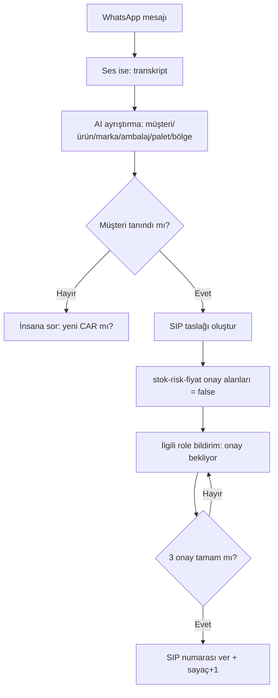

# WF-01 — WhatsApp Sipariş Yakalama

**Tetikleyici:** "Mirfix sipariş" WhatsApp grubuna yeni mesaj (metin/ses).
**Girdi:** Serbest metin/ses → müşteri, ürün, marka, ambalaj, miktar, bölge.

## Adım Şeması

**AI Düğümü:** Ayrıştırma promptu (marka: MİRFİX/İzomir/Dimaxa/Bilfis; ambalaj: şirink/streç/zımba/torba/palet).
**İnsan Müdahale:** Belirsiz müşteri; fiyat onayı (FON — WF-11).
**Hata/Retry:** 3 deneme + insan bildirimi; ayrıştırılamayan mesaj → 00_INBOX'a düşer.
**Log:** `{mesaj_id, çıkarılan_alanlar, güven, sip_kod}`.
**Çıktı:** `42_Siparisler/SIP-*.md` taslağı. **İlgili:** SIP varlığı, Satış Agent. **KPI:** Otomatik yakalanan sipariş %.
