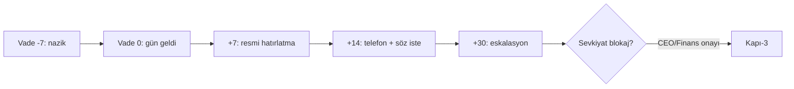

# WF-03 — Tahsilat Hatırlatma (Vade Kademeleri)

**Tetikleyici:** Günlük 09:00 cron — açık THS taraması.
**Girdi:** THS (tutar, vade, kanal, müşteri risk sınıfı).

## Kademeler

**AI Düğümü:** Tahsilat Agent (4.5) — müşteri risk + söz-tutma geçmişine göre ton/kademe.
**İnsan Müdahale:** +30 eskalasyon ve sevkiyat blokajı (Kapı-3).
**Retry:** Mesaj gitmezse 3 deneme + bildirim.
**Çıktı:** Hatırlatma mesajları + THS durum güncel + ödeme sözü kaydı. **KPI:** DSO, söz-tutma oranı.
