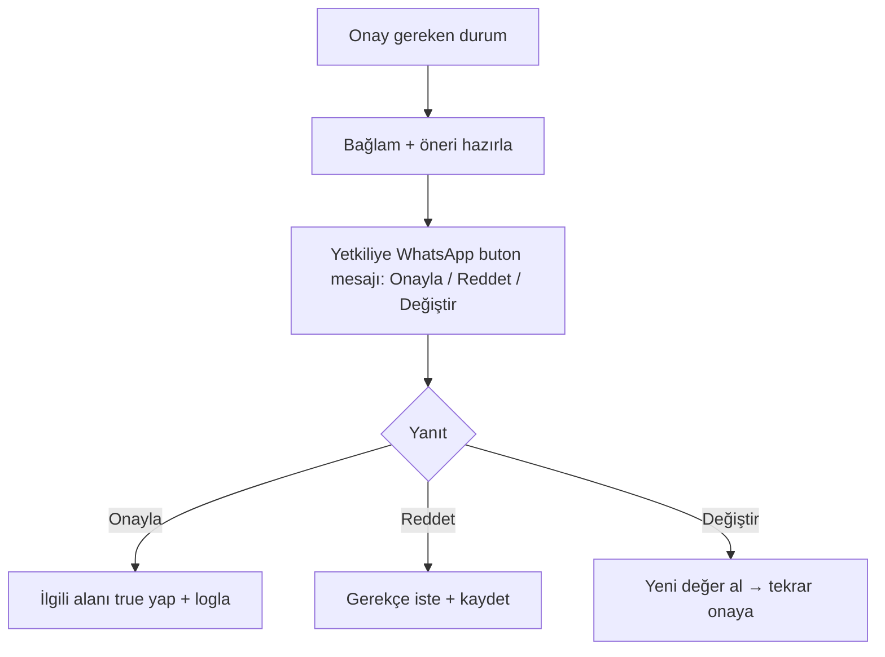

# WF-11 — Onay Akışı (FON: Fiyat Onayı → WhatsApp Buton)

**Tetikleyici:** Fiyat/limit/sevkiyat/iade kararı gerektiren durum (9 kapıdan biri, B1.4).
**Girdi:** Karar bağlamı + öneri (agent'tan).

## Adım Şeması

**İnsan Müdahale:** ÇEKİRDEK — bu WF'in tamamı insan onayıdır.
**Log:** `{kapı, öneren_agent, karar, onaylayan, zaman}` — kararların karnesine (B8.5) besler.
**Çıktı:** Onay damgalı karar. **KPI:** Onay süresi, red oranı.
