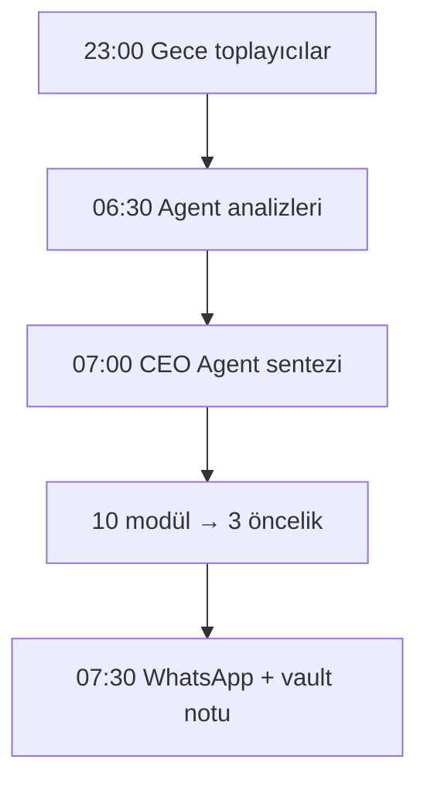

# WF-13 — CEO Sabah Brifingi Teslimatı (B8)

**Tetikleyici:** Zincirleme cron — 23:00 toplayıcılar, 06:30 analizciler, 07:00 sentez, 07:30 teslim.

## Adım Şeması

**AI Düğümü:** 10 modül (B8.2) + CEO Agent (4.2) sentezi.
**İnsan Müdahale:** Yok (teslimat); kararlar WF-11 ile onaylanır.
**Retry:** Teslim başarısız → 3 deneme; toplayıcı boşsa "veri eksik" işareti.
**Çıktı:** `10_SIRKET/13_Kararlar/brifing-YYYY-MM-DD.md` + WhatsApp. **KPI:** Brifing isabet puanı (B8.5).
